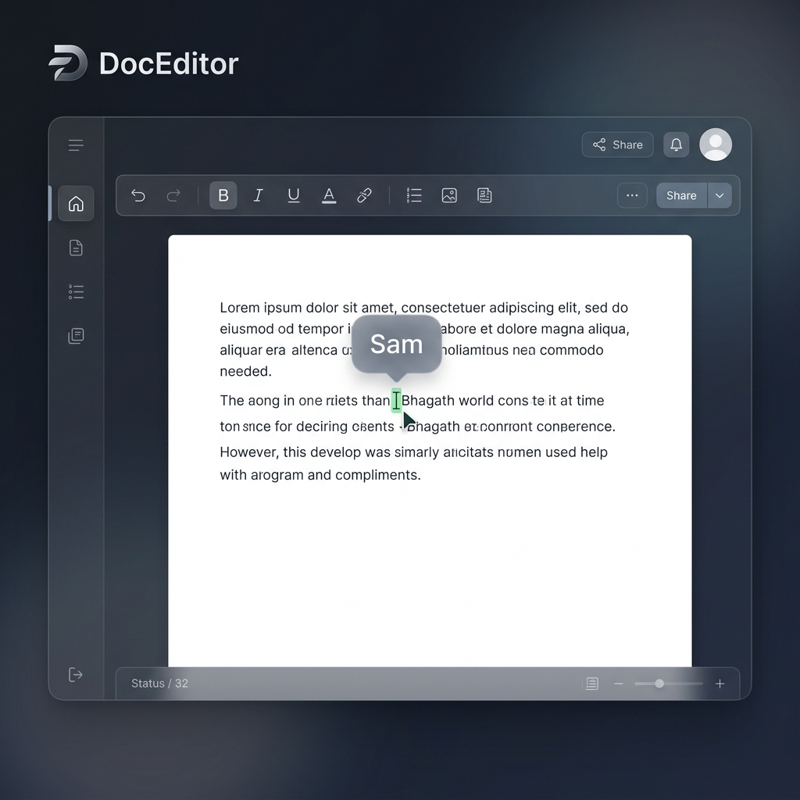

# DocEditor 🚀

[](https://github.com/example/doc-editor/actions)
[](https://opensource.org/licenses/MIT)
[](https://nodejs.org)
[](https://makeapullrequest.com)

A high-performance, full-stack, real-time collaborative document editor inspired by Microsoft Word and Google Docs. Built using **React (Vite)**, **Node.js**, **MongoDB**, **TipTap**, and **Yjs**.

---

## 📸 DocEditor Preview



---

## 🎬 Usage & Feature Demo


---

## ✨ Features

- **Real-Time Collaboration**: Seamless, conflict-free editing powered by **Yjs** CRDTs and WebSockets.
- **Presence Detection**: Live collaborator cursors, active typing indicators, and user avatar headers.
- **Authentication & Security**: Secure user authentication and session management integrated with **Clerk**.
- **Role-Based Document Access**:
  - **Owner**: Full administrative control, sharing management, and deletion capability.
  - **Editor**: Real-time read-write privileges.
  - **Viewer**: Read-only access to sharing sessions.
- **Rich Text Editor**: Powered by **TipTap**, supporting bold, italic, underline, custom fonts, text alignment, highlights, and custom slash-commands.
- **Offline & Auto-Save**: Smart state persistence with local throttled synchronization to MongoDB.
- **Fluid Layout**: Responsive interface with ruler components, adjustable margins, and custom dark glassmorphic styling.

---

## 🛠️ Tech Stack

### Frontend
- **Framework**: React 19 (via Vite)
- **Editor Core**: TipTap (ProseMirror under the hood)
- **State Sync**: Yjs (Y-Websocket client)
- **Styling**: Vanilla CSS (Custom Glassmorphism)
- **Routing**: React Router DOM v7
- **Authentication**: Clerk React SDK

### Backend
- **Runtime**: Node.js
- **Server**: Express
- **Real-time Sync**: Yjs WebSocket Server (`y-websocket`)
- **WebSockets**: Socket.io (secondary signaling)
- **Database**: MongoDB (Mongoose ODM)
- **Authentication**: Clerk Node SDK

---

## 📦 Project Structure

```
DocEditor/
├── .github/              # GitHub Actions workflows and issue/PR templates
│   ├── ISSUE_TEMPLATE/   # Bug report and feature request templates
│   └── workflows/        # CI/CD configuration files
├── backend/              # Node.js + Express API and Yjs WebSocket server
│   ├── models/           # Mongoose schemas (Document model)
│   ├── utils/            # Shared utilities (throttled persistence, etc.)
│   └── test/             # Backend test files
├── frontend/             # React SPA (Vite)
│   ├── src/
│   │   ├── components/   # UI elements (Toolbar, Ruler, ShareModal, etc.)
│   │   ├── extensions/   # Custom TipTap extensions (SlashCommands, FontSize)
│   │   ├── pages/        # Views (Auth, Dashboard, DocumentPage)
│   │   └── assets/       # Static files
│   └── eslint.config.js  # Frontend linting settings
├── docs/                 # Detailed documentation
│   ├── ARCHITECTURE.md   # System architecture and data flow
│   ├── API.md            # REST endpoints and WebSocket protocols
│   ├── CONTRIBUTING.md   # Guidelines for contributions and branching
│   ├── SECURITY.md       # Security policy and vulnerability reports
│   ├── ROADMAP.md        # Future release roadmap
│   └── CHANGELOG.md      # Project history
├── tools/                # Developer utilities and Windows runner scripts
└── README.md             # Repository landing page
```

---

## 🚀 Getting Started

### Prerequisites
- **Node.js** (v20.0.0 or higher)
- **MongoDB** (v6.0 or higher, running locally or on MongoDB Atlas)
- A **Clerk Developer Account** (for authentication API keys)

### Setup Instructions

1. **Clone the Repository:**
   ```bash
   git clone https://github.com/your-username/DocEditor.git
   cd DocEditor
   ```

2. **Configure Environment Variables:**
   Create `.env` files in both the frontend and backend subdirectories based on the provided templates:
   ```bash
   cp backend/.env.example backend/.env
   cp frontend/.env.example frontend/.env
   ```
   Add your Clerk credentials and MongoDB URI to the newly created `.env` files.

3. **Install Workspace Dependencies:**
   This project uses npm workspaces to manage monorepo packages. Install all dependencies from the root directory:
   ```bash
   npm install
   ```

### Running the Application

You can spin up both frontend and backend concurrently from the root:
```bash
npm start
```
- **Frontend** runs on: `http://localhost:5173`
- **Backend API** runs on: `http://localhost:5000`
- **Yjs WebSocket Server** runs on: `ws://localhost:1234`

*Windows users can also use the desktop helper utilities located in the `tools/` folder:*
- Double-click `tools/run_backend.bat`
- Double-click `tools/run_frontend.bat`

---

## 🧪 Testing and Quality Control

Run project-wide validation scripts:
```bash
# Run linting across the workspace
npm run lint

# Build the frontend production bundle
npm run build

# Run unit tests
npm test
```

---

## 🗺️ Future Roadmap

- **v1.0 (Current)**: Live multi-user collaboration, secure roles, and document workspaces.
- **v1.5**: Version history, activity timeline, inline commenting.
- **v2.0**: Built-in AI writing assistant, study modes, and flashcards.
- **v2.5**: Team spaces, smart semantic search, nested workspaces.
- **v3.0**: Native plugins, desktop distributions, and mobile applications.

*For full roadmap details, see [ROADMAP.md](docs/ROADMAP.md).*

---

## 🤝 Contributing

Contributions make the open-source community an amazing place to learn, inspire, and create. Please read [CONTRIBUTING.md](docs/CONTRIBUTING.md) to understand our Git branching strategy and pull request guidelines.

---

## 🛡️ Security

If you discover any security vulnerabilities, please review our reporting guidelines in [SECURITY.md](docs/SECURITY.md).

---

## 📄 License

Distributed under the MIT License. See [LICENSE](LICENSE) for more details.

---

## 🙌 Credits & Acknowledgements

- **Yjs**: High-performance CRDTs for shared editing.
- **TipTap**: Extensible React editor framework.
- **Clerk**: Frictionless authentication flow.
- **Lucide**: Clean iconography.
