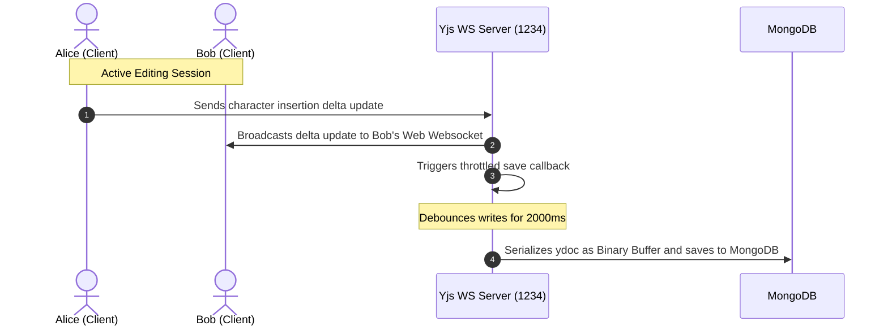

# System Architecture - DocEditor

This document describes the end-to-end architecture, communication channels, database structures, and runtime mechanics of the DocEditor application.

---

## 🏗️ Core Architecture Overview

DocEditor follows a hybrid decentralized-centralized collaborative model. Rich text CRDT operations sync peer-to-peer (mediated via a central WebSocket broker), while authentication, authorization, and directory services are routed through standard HTTP REST APIs.

```mermaid
graph TD
    %% Define Nodes
    Client["React Frontend (Vite)"]
    Clerk["Clerk Auth Provider"]
    API["Express REST Server (Port 5000)"]
    WS["Yjs WebSocket Server (Port 1234)"]
    DB[("MongoDB Database")]

    %% Interactions
    Client -->|1. Authenticate / Retrieve JWT| Clerk
    Client -->|2. HTTP REST Request with JWT| API
    Client <-->|3. Bidirectional CRDT Sync| WS
    API -->|4. Query / Mutate Document Meta| DB
    WS -->|5. Throttled Buffer Updates (2s)| DB
```

---

## 🔒 Deep Dive: Architectural Pillars

### 1. Authentication & Authorization
DocEditor outsources identity provider management to **Clerk** to guarantee security.
- **Client Side**: The React frontend wraps the app entry in `<ClerkProvider>` and enforces route guards using the Clerk React hooks (`useSignIn`, `useSignUp`, `useAuth`, `useUser`).
- **Token Exchange**: Upon login, Clerk issues a JWT token. This token is attached as a Bearer authorization token in standard Axios HTTP headers (`Authorization: Bearer <TOKEN>`) to backend REST requests.
- **Server Side**: The Express backend registers the `clerkMiddleware()` helper. Secured endpoints call `requireAuth` to extract `req.userId` and fetch user metadata using the `@clerk/express` client tools. Unauthorized accesses immediately return a `401 Unauthenticated` payload.

### 2. Real-Time Collaboration
The editor collaboration layer is powered by **Yjs** CRDTs (Conflict-free Replicated Data Types) and structured on top of the **TipTap** document model.
- **TipTap Document**: Text state is parsed into a structured JSON outline.
- **Yjs Shared Doc**: A binary representation of modifications is kept in memory. The client connects to `ws://localhost:1234` through a dedicated `WebsocketProvider`.
- **CRDT Merge Engine**: As users insert, format, or delete characters, operations are packaged into delta updates and broadcasted over WebSockets. The Yjs CRDT engine resolves ordering conflicts deterministically across client nodes without server intervention.

### 3. Presence Detection
Collaborator cursors and typing details are managed via the **Yjs Awareness protocol** built into the WebSocket channel.
- **Awareness State**: Each client maintains a local JSON status state containing `name`, `color`, `avatar`, `id`, and `isTyping`.
- **Broadcasting**: These awareness states are broadcasted to all connected peers editing the same document.
- **Rendering**: The `CollaborationCursor` extension intercepts the cursor updates and dynamically injects CSS caret elements (incorporating user names in floating pill markers) into the TipTap document container.

### 4. Document Persistence
To prevent excessive database writes while maintaining auto-save capabilities, DocEditor uses a throttled binary buffer persistence loop.
- **Memory Buffer**: The WebSocket server maintains the active `Y.Doc` state in memory (`docs` map).
- **Throttled Persistence**: When modifications occur, the server queues updates via a throttled callback:
  ```javascript
  const saveThrottled = throttle(async () => {
    const update = Y.encodeStateAsUpdate(ydoc);
    await Document.findByIdAndUpdate(docName, { 
      ydoc: Buffer.from(update),
      updatedAt: new Date()
    });
  }, 2000);
  ```
- **Database Model**: MongoDB stores metadata (titles, owners, sharing rules) along with a single binary buffer field (`ydoc` Buffer) representing the serialized document update array.

### 5. Sharing & Permissions
Access control is managed at the MongoDB layer:
- **Owner**: The creator Clerk user ID has complete write and delete access.
- **Collaborator Array**: Document schemas maintain a list of permitted user IDs, emails, or usernames alongside roles (`editor`, `viewer`).
- **Share Tokens**: Anonymous read/write is supported via a high-entropy share token (`shareToken`) appended as a query parameter (`?access=shareToken`). The API checks the URL parameters against the database properties to authorize anonymous access.

---

## 🛠️ Data Flow Lifecycle



---

## 🔮 Future Architecture Layers

### 1. Snapshot-Based Versioning
To implement version history (Milestone 1.5):
- **Abstract Schema**: Introduce a `Version` collection referencing the primary `Document` ID.
- **State Serialization**: Periodically capture raw Yjs update logs or serialize the complete document state.
- **Restoration**: Apply previous version updates to a new `Y.Doc` instance to revert states safely.

### 2. Real-Time AI Layer
To integrate AI summaries and writing assistants (Milestone 2.0):
- **Agent Server**: Run a background microservice consuming document updates from the WebSocket channel.
- **AI Completion Endpoint**: Add an API route `POST /api/ai/completion` that processes prompt payloads and streams responses back to TipTap.
- **Background Processing**: Periodically summarize documents asynchronously in the background using LLM APIs and store the results in a dedicated `aiSummary` schema field.
