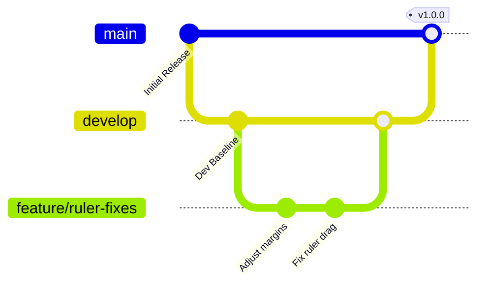

# Contributing to DocEditor

Thank you for your interest in contributing to DocEditor! This document provides guidelines, standards, and workflow setups to help you contribute effectively.

---

## 🗺️ Git Branching Strategy

We follow a structured branching model to maintain repository quality:



### Branch Roles
- **`main`**: Represents the stable production state. Direct commits to `main` are strictly forbidden. All releases are tagged on this branch.
- **`develop`**: The primary integration branch. Feature branches merge into `develop` after passing CI and receiving peer approval.
- **`feature/*`**: Used for developing new features or bug fixes. Always branch off `develop`.
  - *Naming convention*: `feature/short-description` (e.g. `feature/slash-commands`)

### Contribution Flow
1. Branch off `develop` into a new `feature/your-feature` branch.
2. Develop code locally, ensuring your styles align with the custom dark glassmorphism system.
3. Verify changes locally by running `npm run lint`, `npm run build`, and `npm test`.
4. Open a Pull Request targeting the `develop` branch.
5. Address review feedback, verify checks pass, and wait for merge approval.

---

## 🛠️ Local Development Environment Setup

### 1. Requirements
- Node.js (>=20)
- MongoDB running locally

### 2. Monorepo Workspaces Setup
DocEditor utilizes **npm workspaces** to handle dependencies across backend and frontend packages.

Install all workspace dependencies from the root directory:
```bash
npm install
```

### 3. Environment Variables setup
Copy environment configuration files from templates:
```bash
cp backend/.env.example backend/.env
cp frontend/.env.example frontend/.env
```
Fill in details for MONGODB_URI and Clerk credentials.

### 4. Running Locally
Launch both packages simultaneously:
```bash
npm start
```

---

## 📏 Code Style Guidelines

- **JavaScript/React**: Use ES6+ syntax, React functional components, and Hooks. Avoid class components.
- **CSS**: Write vanilla CSS in `index.css`. Group styles under selectors and avoid inline layout specifications.
- **Console Logs**: Remove any debug statements (`console.log`, `console.debug`) before submitting code for review.
- **Testing**: Add descriptive tests in `backend/test_throttle.js` or frontend equivalents to keep checks green.
