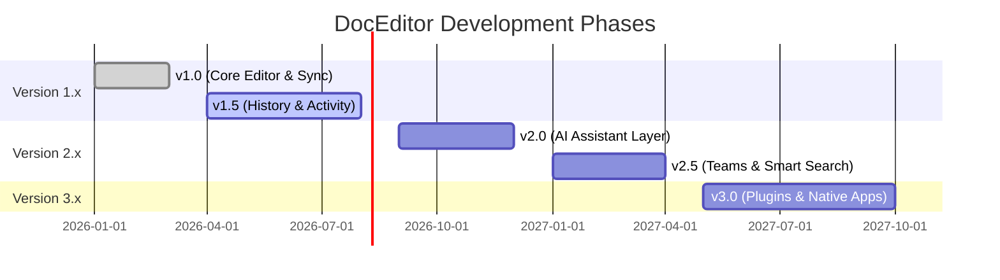

# Product Roadmap - DocEditor

This document outlines the milestones, feature plans, and release cycles for DocEditor.

---

## 📍 Release Roadmap Summary

---

## 📌 Milestone Detailed Plans

### 🔓 Version 1.0 — Core Collaboration (Current)
*Target: Established production-quality codebase*
- [x] **Conflict-free Sync**: Bidirectional real-time editing using Yjs CRDTs.
- [x] **Secure Auth**: Seamless user profiles and login states powered by Clerk.
- [x] **Presence Management**: Floating cursors with participant names, avatars, and status colors.
- [x] **Auto-Save Loop**: Low-overhead database persistence with throttled commits.
- [x] **Workspace Dashboards**: Lists for owned and shared documents with responsive grid/list views.
- [x] **Link Sharing**: Secure invite emails and roles (Viewer, Editor, Owner).

---

### ⏳ Version 1.5 — History & Activity Timeline
*Target: Enterprise document tracking*
- **Version History**: Record historical snapshots of documents. Add a side panel to view differences and restore past edits.
- **Activity Feed**: Live log showing who edited what, featuring detailed timelines.
- **Rich Comments**: Select text blocks to attach comments and threads. Support mentions (`@username`) and resolution triggers.
- **Rich Media Support**: Direct image upload and drag-and-drop embedding with resizing capabilities.

---

### 🧠 Version 2.0 — AI Writing Assistant & Study Suite
*Target: Intelligent document enrichment*
- **Inline AI Prompts**: Use a `/ai` slash command to write, rephrase, expand, or summarize text blocks.
- **Background Document Summarizer**: Auto-generate document summaries displayed on the user dashboard.
- **Study Mode & Flashcards**: Convert document outlines into interactive study flashcards powered by AI.
- **AI-driven Template Engine**: Generate complete document scaffolds based on prompt instructions.

---

### 🏢 Version 2.5 — Workspaces & Advanced Operations
*Target: Organization-wide structure*
- **Nested Folder Structure**: Organize documents into files, subfolders, and multi-tier collections.
- **Team Spaces**: Shared organization boards with centralized access rules.
- **Smart Semantic Search**: Search all documents using natural language queries powered by vector embeddings.
- **Markdown & Export Tools**: Import/Export documents to `.docx`, `.pdf`, `.md`, and `.html`.

---

### 📱 Version 3.0 — Platform Expansion
*Target: Omnipresent availability*
- **Extensible Plugin Ecosystem**: Standard API for writing custom editor plugins (e.g. embed codes, code runner widgets).
- **Desktop Application**: Cross-platform desktop apps built on Electron or Tauri, with offline-first synchronization.
- **Mobile Application**: Native mobile clients (iOS & Android) with touch-optimized collaborative drawing toolbars.
